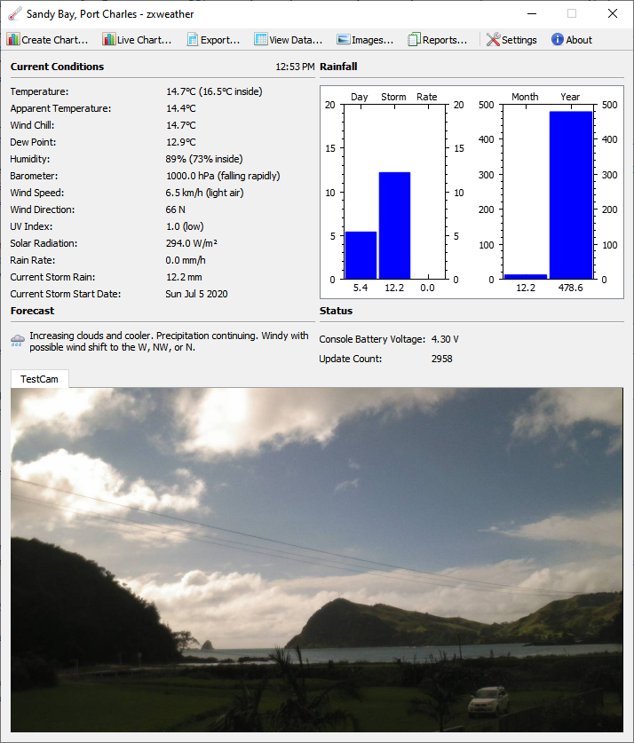

# zxweather

zxweather is the suite of applications built to run weather.zx.net.nz. Compared to other available software it has a few sometimes rare abilities:

  - All data is stored in a PostgreSQL database making it easily available for ad-hoc querying and use in other software
  - Data logging and display are separate roles performed by separate applications. No running a graphical application 24x7 on some windows PC just to keep a website up-to-date
  - The desktop app is fully functional, works anywhere in the world and is 100% optional. It fills a similar role to the web interface - a way to look at your collected data. Actually collecting and storing the data is done elsewhere.
  - Data can be copied between databases using an efficient binary protocol. Internet traffic can be under a megabyte a day reporting current conditions every 2.5 seconds and archive records every 5 minutes. This makes running a remote weather station on a cellular modem a possibility without having to compromise on reporting frequency
   - Current conditions are current. Because zxweather can move weather data efficiently there is no reason to slow down how fast the web and desktop interfaces update. Everything updates at the same speed as the weather station itself - every 2.5 seconds for Davis hardware and 48 seconds for FineOffset.
   - Multiple weather stations are supported in one database. The web interface has a menu in the top-right for switching stations.
   - The web interface is not a collection of static HTML files generated and FTPd somewhere on a schedule. Its a regular boring web app that generates pages on demand from the latest data available in the weather database.
   
## What does it look like?
Visit http://weather.zx.net.nz to get an idea of what the web interface looks like. Note that this weather station is in a fairly remote location and its internet connection can drop out for hours or days at a time so if you see no recent data that will be why. In that case, try a different weather station with a more stable internet connection: http://weather.zx.net.nz/s/hlz/

Because the desktop app (pictured below) works just as well over the internet as it does sitting next to the weather station you can try this out too! More screenshots, a test build and setup instructions to connect to the pictured weather station are available at http://weather.zx.net.nz/s/sb/desktop/intro.html.

### The Desktop App
The desktop app, pictured above, can do lots of things! A lot more than the fairly inflexible web interface:
   - Plot current conditions in a chart. One data point every 2.5 seconds updated live as new data comes in.
   - Plot archive data however you like. Any variables over any timespan. You can even have multiple X axes covering different timespans allowing you to, for example, plot this years rainfall over the top of last years.
   - Export data to CSV and load it into Excel if the built-in charts aren't quite what you want
   - View data in a sortable grid. Same options as with charts. Copy&Paste to excel works as you'd expect.
   - Both charts and view data support aggregates. You can use this to plot a running total of rainfall or turn multiple data points into one giving you a chart or table of hourly highs or 30 minute lows, daily rainfall totals, etc.
   - The Images window lets you conveniently browse all captured images and time-lapse videos in the database. It can show the conditions at the time the image was taken. This works for time-lapse videos too where the conditions shown change as the video plays
   
It also contains a basic reporting engine allowing you to build custom reports producing outputs in HTML, Plain Text or a sortable grid. The supplied built-in reports are made with the same tools and live under the same constraints so anything a built-in report can do a custom report can do too. 

The following WeatherLink-compatible reports are supplied:

   - Leaf Wet Hours (requires Vantage Pro2 with leaf wetness sensor)
   - NOAA Month Summary
   - NOAA Year Summary
   - Rainfall totals
   - Soil Temperature Hours
   - Sunrise & Sunset. This report also provides an HTML view with daylight savings changes and the current day highlighted.
   - Sunshine hours. This report uses a more advanced algorithm than the equivalent WeatherLink report and provides a links to plot a solar radiation chart or view images for each day.

Plus some extras:
   - Monthly Averages: gives numbers like Average January rainfall, daily mean for february, etc.
   - Station Records: all time highs and lows per sensor
   - Storm Rain: Gives you all the past rain storm events calculated using a similar algorithm to Davis weather stations. A link to plot a rainfall chart is provided for each storm

## Installation
Installation is not easy. Proper install documentation hasn't been updated since 2013 and a lot has changed since then. Until I get around to updating the documentation there are [some very brief notes](doc/interim_install_notes.md) that might be ok if you know linux and python and are up for the challenge.

## Future Plans

 - Port to Python 3 now that Python 2.7 is no longer available in Debian stable
 - Fix the known bugs and finish off a stable documented release that people can run if its useful to them.
 - The Web UI really needs rewriting as part of its port to python 3. I'd like to switch from webpy to Flask as its web framework while I'm at it and overhaull the templates, etc.
 - The desktop app needs a heavy refactoring. Its grown fairly organically over the last several years and its code has become quite a mess. A clean up is long over due and should allow some new features I've got in mind to be supported once its done.

## Current Limitations

- Much of the software currently requires Python 2.7 which is now out of support so getting this from a linux distributions package repository may be difficult. A python3 port is currently in progress but it may be a while before its finished and "stable".
- The Web Interface is fairly inflexible at the moment. The JavaScript is fairly tightly coupled to the templates so customing it isn't really realistic. There are plans to fix this (see: future plans, web UI rewrite)
- This software primarily deals in data using metric units. Support for US units is limited to the desktop interface. The web interface may get support too some day but its not really a priority as most of the world uses metric.
- Supporting new types of weather stations that have more sensors than something like the FineOffset WH1080 is quite difficult at the moment. The way extra sensors are stored in the database and handled through-out the rest of the software needs to be improved somewhat. This will be fixed eventually.
- Archive intervals longer than 5 minutes are supported *in theory*. The code is there to handle it but its never really been tested and there isn't really much incentive to do so. There doesn't really seem to be much reason to use longer archive intervals.

## License
The desktop client, due to its dependency on QCustomPlot, is licensed under the GNU GPL version 3. All other components are licensed under the GNU GPL version 2 or higher.
